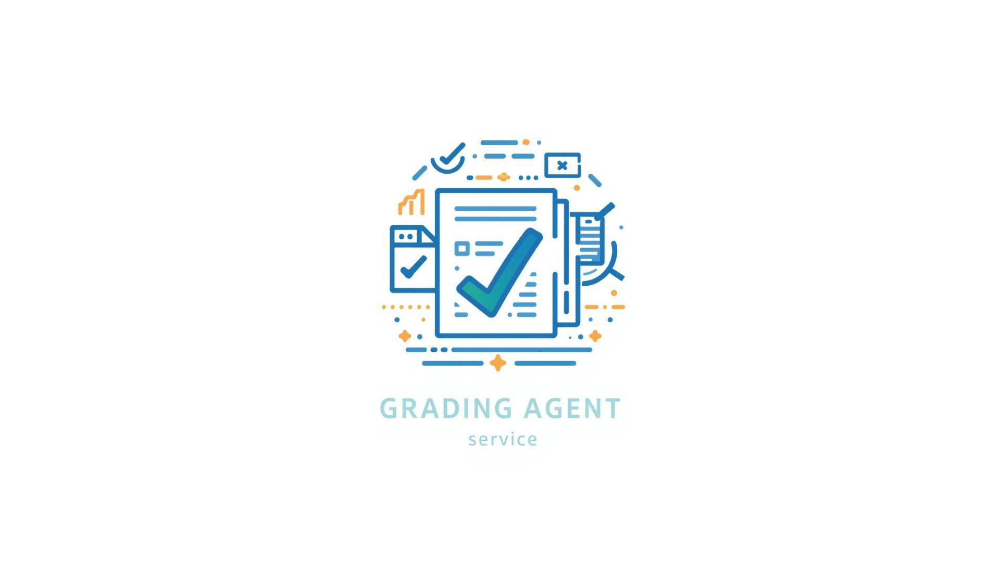

## Project Overview - Agent Graduator

**NOTE:** This is a submission for the Kaggle Agents Intensive Capstone project.

This project contains the core logic for **Agent Graduator**, a sequential multi-agent system designed to automate the assessment of student PDF assignments. The agent is built using **LangChain** and **LangGraph**, utilizing a "Chain of Thought" architecture to read, fact-check, and grade submissions with university-level rigor.

### Problem Statement

In higher education, grading is the single biggest bottleneck. It is **laborious**, requiring professors to spend countless hours parsing similar documents rather than teaching. It is **inconsistent**; "grading fatigue" often leads to variance in scores between the first paper graded and the last. Furthermore, manual grading is often opaque—students rarely receive a detailed breakdown of *why* they lost points on factual accuracy versus formatting. As class sizes grow, educators are forced to trade off between the depth of feedback and the speed of return.

### Solution Statement

**Agent Graduator** acts as an indefatigable "Digital Teaching Assistant." It automates the entire assessment lifecycle by treating grading as a multi-step reasoning process rather than a simple text generation task.

The system first **digitizes** raw student submissions (PDFs), then **validates** factual claims against real-time web data to catch hallucinations or errors, and finally **evaluates** the work against a strict rubric. This ensures 100% consistency across all students, provides immediate detailed feedback, and allows educators to focus on curriculum design and student mentorship rather than administrative processing.

### Architecture

Core to Agent Graduator is the **Sequential Grading Pipeline**—a classic example of a "Stateful" Multi-Agent System. It is not a monolithic prompt but a chain of specialized nodes, each responsible for a distinct phase of the grading process. The workflow is orchestrated using **LangGraph**.

The system operates on a shared `AgentState` that passes the submission data through three distinct phases:

**1. The Eye: `extractor_agent` (Ingestion)**

This agent uses a **Custom Tool** (`read_pdf_submission`) to act as the system's eyes. It handles the I/O operations, robustly parsing PDF files (handling layout and encoding) and converting them into clean text stored in the state. If a file is unreadable, the agent halts the process, saving computational resources.

**2. The Truth Seeker: `researcher_agent` (Verification)**

Unlike standard LLMs that may hallucinate facts, this agent is equipped with the **Tavily Search Tool** (Built-in). It analyzes the student's text, identifies key factual claims, and cross-references them with live web data. It injects a "Fact Check Report" into the state, flagging inaccuracies before the grading even begins.

**3. The Professor: `grader_agent` (Evaluation)**

This is the final decision-maker. It synthesizes the original student text and the `researcher_agent`'s Fact Check Report. It applies a strict Rubric and uses **Structured Output** (JSON) to guarantee the final grade is machine-readable (e.g., `{score: 85, feedback: "..."}`).

### Essential Tools and Observability

**Custom Tool: PDF Extraction**
A wrapper around `pdfplumber` that allows the agents to ingest raw course files directly from the local directory.

**Built-in Tool: Tavily Search**
Used by the Researcher node to ground the grading process in reality, ensuring students aren't rewarded for confident but incorrect statements.

**Observability: LangSmith Tracing**
To solve the "Black Box" problem of AI grading, this project implements full observability. Every step—from the text extracted from the PDF to the specific search query used to verify a fact—is logged in **LangSmith**. This allows the human professor to "audit" the AI's decision-making process if a student disputes a grade.

### Value Statement

Agent Graduator has the potential to reduce grading time from **10-15 minutes per paper to under 30 seconds**. For a class of 50 students, this reclaims over 10 hours of productivity per assignment cycle.

Beyond time savings, the integration of the **Researcher Agent** provides a value manual grading often skips: rigorous fact-checking. I have found that the agent catches subtle factual errors that a tired human grader might gloss over. The **Observability** layer also provides a defensible "paper trail," giving both students and administrators confidence in the fairness of the automated score.